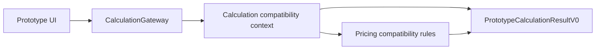

# Prototype v0 — context map миграции

Дата: 28 августа 2026 года.

## Границы

- `Prototype UI` владеет отображением и редактируемым frontend draft, но не формулами.
- `CalculationGateway` является frontend-портом. Сейчас его реализует локальный TypeScript adapter; позднее его заменит HTTP adapter.
- `Calculation` владеет геометрическими промежуточными значениями, деталями, фурнитурой, сроком и предупреждениями текущего алгоритма.
- `Pricing` логически отделено от Calculation, хотя в исходной функции они пока расположены вместе. При переносе на Symfony формулы разделяются без изменения результата.
- Контракты находятся в `contracts/prototype-v0`, fixtures — в `contracts/fixtures/prototype-v0.json`.

Контексты Identity, Project, Catalog и Marketplace намеренно отсутствуют: их создание запрещено до приёмки технической миграции.
