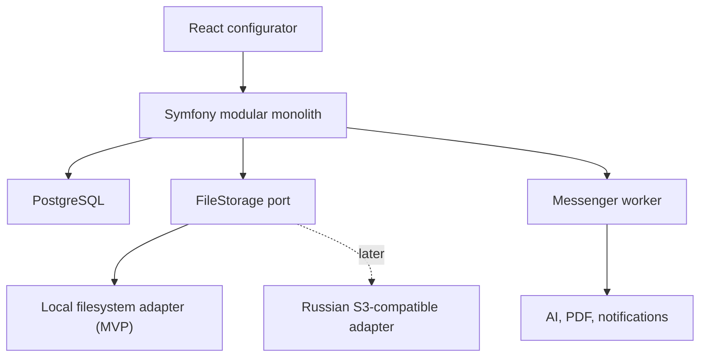

# Furniture OS — исправленный план проекта

Дата решения: 25 августа 2026 года.

Исполнение разделено на два последовательных документа:

1. [`technology-migration-plan.md`](technology-migration-plan.md) — перенос текущего прототипа и настройка окружения без нового функционала;
2. [`product-development-plan.md`](product-development-plan.md) — новый функционал после отдельной приёмки миграции.

Смешивать техническую миграцию и продуктовые изменения в одном PR запрещено.

## 1. Итоговое решение

Furniture OS развивается как модульный монолит со следующей базовой архитектурой:

- frontend: React, TypeScript, Vite;
- backend: PHP 8.4, Symfony 7.4 LTS;
- база данных: PostgreSQL;
- ORM и миграции: Doctrine ORM и Doctrine Migrations;
- фоновые задачи: Symfony Messenger;
- файлы MVP: локальное файловое хранилище за прикладным портом; позднее — российское S3-совместимое хранилище без изменения доменной логики;
- точная визуализация MVP: параметрический SVG;
- AI-визуализация: асинхронное редактирование контрольного изображения;
- 3D: отдельный последующий этап на Three.js после проверки продуктовой гипотезы;
- deployment: Docker, GitHub Actions, отдельные web/API/worker-процессы.

Node.js не используется как backend. Он остаётся только инструментом сборки и тестирования frontend.

На старте не создаются микросервисы. Go не добавляется как второй backend. Если позднее появится вычислительно тяжёлая оптимизация раскроя, CAD/CAM-конвертация или массовый пакетный расчёт, такой изолированный модуль можно реализовать на Go после профилирования и определения стабильного контракта.

## 2. Оценка исходного плана

### Что в исходном плане сделано хорошо

- Правильно определено текущее состояние как UI-прототип, а не готовый конструктор.
- Найдены реальные проблемы CI, сборки, зависимостей и расчётной функции.
- Выбран модульный монолит вместо преждевременных микросервисов.
- Авторитетным источником назван версионированный snapshot, а не состояние frontend или AI-картинка.
- Конфигурация отделена от каталога, прайс-листа и версии правил.
- Ошибки отделены от предупреждений.
- RFQ и предложения производителей привязаны к неизменяемой ревизии проекта.
- Предварительная оценка Furniture OS отделена от подтверждённого предложения производителя.
- Первый PR ограничен стабилизацией и не смешивает исправление инфраструктуры с изменением формул.

### Что необходимо изменить

1. Backend на Node.js/Fastify выбран без достаточного продуктового основания. Совпадение языка frontend и backend не даёт здесь существенного преимущества: инженерные расчёты и финансовые данные всё равно должны быть серверными, а API-контракт можно генерировать из OpenAPI.
2. Исходный roadmap откладывает главную бизнес-гипотезу — получение предложений производителей — почти в конец.
3. Одновременно включены точная BOM, 3D, AI, PDF, marketplace и производственные форматы. Для первого пилота это чрезмерный объём.
4. Производственно достоверная деталировка ошибочно воспринимается как обязательное условие проверки marketplace. Для первого RFQ-пилота достаточно стандартизированного технического задания; финальную производственную документацию подтверждает изготовитель.
5. Не описаны onboarding производителей, SLA ответа, предварительная и подтверждённая цена, ответственность за замер, сопоставимость предложений и уход сделки с площадки.
6. React можно сохранить как текущий frontend-стек, но наличие React Three Fiber не делает 3D обязательной функцией MVP.

## 3. Frontend: React

Оба варианта технически подходят. Выбор не влияет на backend, PostgreSQL, RFQ или расчётную модель.

| Критерий | Vue 3 | React |
| --- | --- | --- |
| Текущий код | Потребуется небольшой перенос | Уже используется |
| Формы и реактивный конфигуратор | Очень удобны Composition API и computed | Хорошо реализуемо через hooks/store |
| TypeScript | Полноценная официальная поддержка | Полноценная поддержка |
| Глобальное состояние | Pinia | Zustand/Redux |
| Маршрутизация | Официальный Vue Router | React Router |
| 3D-экосистема | Three.js напрямую, при желании TresJS | Three.js, сильная интеграция React Three Fiber |
| Порог поддержки для владельца проекта | Ниже с учётом имеющегося опыта Vue | Потребуется углубление в React |

### Решение

Оставить React и развивать существующий frontend без миграции на другой фреймворк.

React уже используется в прототипе и технически подходит для форм, конфигуратора, SVG и возможного будущего 3D. Сохранение текущего стека убирает миграционную работу и позволяет после стабилизации репозитория перейти непосредственно к доменному контракту и пользовательским сценариям.

Рекомендуемый frontend-стек:

- React с функциональными компонентами и hooks;
- TypeScript;
- Vite;
- React Router;
- Zustand для состояния текущего проекта, undo/redo и черновика;
- `@tanstack/react-query` для серверного состояния;
- Zod или Valibot для клиентской проверки API-ответов и быстрых UI-проверок;
- Vitest и React Testing Library;
- Playwright для E2E;
- scoped CSS, CSS Modules или обычный CSS с design tokens.

Тяжёлый UI-фреймворк для клиентского конструктора пока не нужен. Готовая библиотека компонентов может ускорить кабинет производителя или административные экраны, но её стили не должны определять внешний вид пользовательского конструктора.

## 4. Backend: Symfony или Go

### Почему основной backend — Symfony

Ближайшие задачи Furniture OS преимущественно бизнесовые:

- пользователи, организации и роли;
- проекты и неизменяемые ревизии;
- каталоги материалов и фурнитуры;
- версии цен;
- RFQ и приглашения производителей;
- структурированные предложения;
- статусы и переходы состояний;
- уведомления;
- PDF;
- аудит действий;
- административные операции.

Symfony закрывает эти задачи быстрее и с меньшим количеством собственного инфраструктурного кода. Symfony Workflow подходит для контролируемых переходов статусов, Messenger — для AI-рендеров, PDF и уведомлений, Security — для ролей и доступа.

Выбран Symfony 7.4 LTS, а не краткоживущая stable-ветка. Эта версия получает bug fixes до ноября 2028 года и security fixes до ноября 2029 года.

### Когда был бы оправдан Go

Go также может быть единственным backend проекта. Его стоит выбрать вместо Symfony, если основной личный интерес — строить продукт именно на Go и допустима более ручная реализация бизнес-инфраструктуры.

Go особенно уместен для:

- оптимизации размещения деталей на листах;
- вычислительно тяжёлой геометрии;
- CAD/CAM и CNC-конвертации;
- массовых пакетных расчётов;
- высоконагруженных интеграционных шлюзов.

Однако на этапе MVP производительность PHP не является риском. Нельзя одновременно начинать Symfony-backend и Go-сервис: это увеличит число контрактов, контейнеров, deployment-процессов и точек отказа до появления нагрузки.

### Backend-стек

- PHP 8.4;
- Symfony 7.4 LTS;
- Symfony Validator, Serializer, Security, Workflow, Messenger и HttpClient;
- Doctrine ORM и Doctrine Migrations;
- PostgreSQL;
- OpenAPI как контракт с frontend;
- session cookie с HttpOnly/Secure/SameSite при размещении web и API на одном домене;
- локальное файловое хранилище для MVP через абстракцию приложения;
- Flysystem как техническая основа адаптеров локального и будущего S3-совместимого хранилища;
- HTML-шаблон и отдельный HTML-to-PDF renderer;
- структурированные логи и error tracking;
- OpenTelemetry после появления нескольких внешних интеграций.

Для первой очереди Messenger можно использовать PostgreSQL/Doctrine transport. Redis или RabbitMQ добавляются только при подтверждённой необходимости.

## 5. Целевая архитектура



Структура репозитория после контролируемой миграции:

```text
Furniture-OS/
├── apps/
│   ├── web/                 # React + TypeScript + Vite
│   └── api/                 # Symfony
├── docs/
├── infra/
│   ├── docker/
│   └── compose.yaml
├── .github/workflows/
├── AGENTS.md
└── README.md
```

Модули backend:

```text
src/
├── Identity/
├── Project/
├── Cabinet/
├── Catalog/
├── Calculation/
├── Pricing/
├── Marketplace/
├── Rendering/
├── Document/
└── Shared/
```

Это логические модули одного приложения, а не отдельные сервисы.

### DDD и границы слоёв

DDD применяется прагматично: модель отражает язык мебельного производства и marketplace, но проект не усложняется абстракциями без доменной пользы. Каждый backend-модуль делится на слои:

```text
Module/
├── Domain/                 # сущности, value objects, агрегаты, доменные события и правила
├── Application/            # use cases, команды, запросы и порты
├── Infrastructure/         # Doctrine, файловая система, внешние API и Messenger
└── Presentation/           # HTTP controllers, CLI и сериализация API
```

Правила зависимостей:

- `Domain` не зависит от Symfony, Doctrine, HTTP, файловой системы и внешних SDK;
- `Application` зависит от домена и объявляет необходимые порты;
- `Infrastructure` реализует порты приложения;
- `Presentation` вызывает application use cases и не содержит бизнес-правил;
- агрегаты изменяются только через собственные методы и сохраняются через repository-порты;
- между модулями используются явные контракты, идентификаторы и события, а не прямой доступ к внутренним таблицам и классам;
- `Shared` содержит только действительно общие примитивы и не становится складом случайных классов;
- архитектурные тесты автоматически контролируют направление зависимостей.

### Хранение файлов и бесшовная миграция

В MVP файлы хранятся локально в выделенном persistent volume вне публичного web-root. Домен оперирует только `FileId` и метаданными, но не абсолютными путями или URL.

Application-слой объявляет минимальный порт хранения с операциями записи, чтения, удаления, проверки существования и формирования ограниченной ссылки на скачивание. Локальный адаптер реализует этот порт первым. Будущий адаптер российского S3-совместимого провайдера реализует тот же контракт.

В PostgreSQL хранятся идентификатор файла, владелец, назначение, MIME type, размер, checksum, storage key, статус и даты. Содержимое файла в PostgreSQL не сохраняется. Публичный URL не является частью доменной модели и формируется адаптером на время запроса.

Чтобы миграция не останавливала приложение:

- ключ объекта не содержит локального абсолютного пути и одинаково применим к обоим адаптерам;
- выбор адаптера задаётся конфигурацией окружения;
- checksum проверяет целостность при копировании;
- мигратор идемпотентно копирует объекты и фиксирует backend хранения для каждой записи;
- на переходный период чтение поддерживает старый и новый backend, а новые записи направляются только в новый;
- удаление выполняется через application use case и журналируется;
- локальный каталог включается в backup/restore и проверяется регулярным тестовым восстановлением.

## 6. Источник истины и API

Авторитетный расчёт выполняется только backend.

Frontend может мгновенно показывать размеры, перемещать секции и строить SVG, но не имеет права самостоятельно утверждать:

- производственную корректность;
- окончательную BOM;
- себестоимость;
- цену;
- срок;
- совместимость фурнитуры.

При изменении конфигурации frontend отправляет запрос расчёта с debounce. Backend возвращает нормализованную геометрию, ошибки, предупреждения и предварительную оценку.

Типы TypeScript генерируются из OpenAPI. Дублировать PHP-модель вручную в TypeScript не следует.

Ключевые объекты:

- `CabinetDraft` — редактируемый черновик;
- `CabinetRevision` — неизменяемая версия конфигурации;
- `ValidationResult` — ошибки и предупреждения с кодом и путём поля;
- `CalculationSnapshot` — результат с версиями правил и цен;
- `RenderJob` — асинхронная визуализация;
- `RFQ` — запрос предложений по конкретной ревизии;
- `SupplierOffer` — нормализованное предложение производителя;
- `ConfirmedOrderSpecification` — результат профессионального замера и подтверждения.

Размеры хранятся целыми миллиметрами. Деньги — целыми копейками с валютой. Исторические предложения не пересчитываются после обновления прайс-листа.

PostgreSQL хранит основные бизнес-сущности реляционно. JSONB используется для неизменяемых snapshots и редко меняющихся расширяемых параметров, но не заменяет таблицы пользователей, RFQ, предложений и статусов.

## 7. Визуализация и AI

### Точная визуализация MVP

Первый технический вид реализуется в SVG и строится из конфигурации:

- внешний контур;
- секции;
- фасады;
- полки, штанги и ящики;
- основные размеры;
- открытый и закрытый вид.

SVG дешевле и быстрее 3D, удобен для тестирования и может использоваться как контрольное изображение для AI.

### AI-визуализация

AI не строит инженерную модель. Он получает контрольное изображение и создаёт рекламную визуализацию:

```text
CabinetRevision
→ SVG/контрольный PNG
→ AI image edit
→ концептуальный рендер
```

Результат маркируется как концептуальный. Он не участвует в BOM, расчёте и производстве.

AI-задача должна содержать provider, model, promptVersion, input checksum, status, стоимость, время, retry count и ссылки на результаты. Повторная генерация одинакового запроса кешируется.

### 3D

Three.js добавляется только после проверки, что пользователям недостаточно SVG и AI-рендера. Его не нужно включать в критерии первого marketplace MVP.

## 8. Marketplace и RFQ

Furniture OS должен быть управляемой RFQ-площадкой, а не открытым аукционом минимальной цены.

Первый сценарий:

1. Пользователь создаёт проект.
2. Система формирует неизменяемую ревизию и предварительный диапазон цены.
3. Пользователь подтверждает отправку.
4. Площадка выбирает 3–5 подходящих производителей по региону и возможностям.
5. Производители отправляют структурированные предварительные предложения.
6. Пользователь сравнивает цену, срок, материалы, доставку, монтаж и гарантию.
7. Выбранный производитель выполняет профессиональный замер.
8. Формируется подтверждённая спецификация и окончательная цена.

В предложении отдельно указываются:

- мебель;
- материалы и допустимые замены;
- фурнитура;
- замер;
- доставка;
- подъём;
- монтаж;
- срок;
- гарантия;
- НДС;
- срок действия предложения;
- допустимое изменение после замера.

Платформа не должна автоматически выбирать самое дешёвое предложение. Сравнение учитывает полноту, рейтинг, гарантию, сроки и историю изменения цены.

Для пилота onboarding производителей выполняется вручную. Открытая регистрация, платежи, escrow и арбитраж не входят в первый MVP.

Начальная монетизация проверяется через подписку производителя или оплату за квалифицированную заявку. Комиссия с заказа добавляется только после появления платежей и механизмов, удерживающих сделку внутри платформы.

## 9. Исправленные границы MVP

### MVP-1: конструктор и стандартизированное ТЗ

- один прямой распашной шкаф;
- один утверждённый конструктив;
- ограниченные диапазоны размеров;
- 1–5 секций;
- полки, штанга и типовой блок ящиков;
- небольшой каталог материалов и фурнитуры;
- серверная валидация;
- ориентировочный расчёт;
- сохранение проекта и ревизий;
- параметрический SVG;
- PDF/JSON технического задания.

### MVP-2: пилот биржи

- один город;
- 5–10 вручную проверенных производителей;
- отправка проекта 3–5 подходящим производителям;
- кабинет или упрощённая форма ответа;
- нормализованное предложение;
- сравнение предложений;
- предварительная и подтверждённая цена;
- журнал статусов и событий.

### Эксперимент после MVP-2

- один AI-рендер на ревизию;
- ограниченный выбор стилей;
- лимит расходов;
- opt-out;
- оценка влияния на завершение конфигуратора и отправку RFQ.

### Не входит в первые два MVP

- производственный nesting;
- CNC и присадка произвольной сложности;
- полноценный 3D-конструктор;
- AR и сканирование комнаты;
- кухни и сложная встроенная мебель;
- автоматический onboarding производителей;
- платежи и escrow;
- автоматический выбор победителя;
- отдельные микросервисы;
- мобильные native-приложения.

## 10. Исправленный roadmap

### Этап 0. Проверка предложения параллельно разработке

- Интервью минимум с 10 покупателями и 10 производителями.
- Зафиксировать обязательные поля ТЗ и предложения.
- Найти 5–10 производителей для пилота.
- Согласовать, какие параметры позволяют дать предварительную цену без выезда.

Критерий выхода: минимум пять производителей готовы рассчитывать стандартизированные заявки в оговорённый срок.

### Этап 1. Стабилизация репозитория

- Зафиксировать зависимости и lockfile.
- Исправить build и CI.
- Добавить test, typecheck и build для pull request.
- Зафиксировать текущее поведение characterization-тестом.

Критерий выхода: чистый clone воспроизводимо проходит проверки.

### Этап 2. Структурирование React frontend

- Сохранить существующий экран и его поведение.
- Добавить characterization- и скриншотные проверки.
- Разделить страницы, компоненты, состояние и domain/API adapters.
- Подготовить структуру для пошагового конфигуратора без добавления нового расчёта.

Критерий выхода: пользователь видит тот же прототип, CI зелёный, frontend готов к вертикальной реализации сценариев.

### Этап 3. Доменный контракт

- Вместе с мебельным технологом описать конструктив.
- Разделить ошибки и предупреждения.
- Подготовить 10–15 эталонных конфигураций.
- Зафиксировать версии правил, единицы и округления.

Критерий выхода: схема и fixtures согласованы до реализации нового расчёта.

### Этап 4. Symfony foundation

- Добавить Symfony-приложение и PostgreSQL.
- Реализовать пользователей, проекты и ревизии.
- Добавить каталог и версии прайс-листа.
- Опубликовать первый OpenAPI-контракт.
- Реализовать порт файлового хранения и локальный адаптер с persistent volume.
- Настроить Docker и backend CI.

Критерий выхода: frontend создаёт, сохраняет и открывает ревизию через API.

### Этап 5. Рабочий конфигуратор

- Реализовать формы размеров и наполнения.
- Добавить серверную валидацию и расчёт.
- Построить параметрический SVG.
- Добавить черновик и undo/redo.
- Генерировать PDF/JSON ТЗ.

Критерий выхода: пользователь самостоятельно формирует допустимое стандартизированное ТЗ.

### Этап 6. RFQ-пилот

- Добавить производителей и capability profile.
- Реализовать приглашения и deadline.
- Добавить structured offer и сравнение.
- Разделить предварительную и подтверждённую цену.
- Первый месяц допускается ручное сопровождение оператором.

Критерий выхода: реальный пользователь получает минимум два сопоставимых предложения по одной ревизии.

### Этап 7. AI-эксперимент

- Генерировать контрольное изображение.
- Реализовать Messenger job и provider adapter.
- Добавить лимиты, retry, кеширование и opt-out.
- Проверить влияние AI на продуктовую воронку.

Критерий выхода: принято решение KILL, ITERATE или SCALE на основе метрик, а не визуального впечатления.

### Этап 8. Hardening и дальнейшее производство

- RBAC, аудит, backup/restore и privacy.
- Accessibility и нагрузочные проверки.
- Верификация производителей и отзывы по завершённым заказам.
- При необходимости 3D.
- Затем точный раскрой, остатки, операции и CAD/CAM.

## 11. Метрики пилота

- доля пользователей, завершивших конфигурацию;
- доля проектов, отправленных в RFQ;
- доля RFQ, получивших минимум два предложения;
- медианное время первого ответа;
- доля производителей, повторно отвечающих на заявки;
- конверсия предложения в замер;
- конверсия замера в договор;
- отклонение подтверждённой цены от предварительной;
- процент заказов, выполненных в заявленный срок;
- стоимость квалифицированной заявки;
- влияние AI-рендера на отправку RFQ.

Для первого пилота целевые ориентиры, которые нужно подтвердить данными:

- не менее 50% квалифицированных RFQ получают два предложения;
- первое предложение приходит не позднее 24 часов;
- медианное изменение цены после замера не превышает 10%;
- минимум 10% квалифицированных заявок доходят до договора.

## 12. Тестирование

Тестирование является частью определения готовности, а не отдельным этапом после реализации. Исправление дефекта начинается с воспроизводящего теста. Новая бизнес-функция принимается только вместе с тестами её правил и публичного контракта.

### Frontend

- unit: Vitest;
- component: React Testing Library;
- E2E: Playwright;
- visual regression для существующего интерфейса и SVG;
- accessibility для основного пользовательского пути.

### Backend

- быстрые unit-тесты доменной модели и правил расчёта без Symfony kernel и базы данных;
- application-тесты use cases с in-memory/fake реализациями портов;
- integration-тесты с PostgreSQL;
- contract tests, одинаково запускаемые для локального и будущего S3-адаптера;
- API contract tests;
- tests переходов Workflow;
- tests идемпотентности фоновых задач;
- golden fixtures, подтверждённые технологом;
- boundary/property tests для размеров и стоимости.

Каждое изменение формулы требует новой версии ruleset или явно задокументированной совместимой корректировки.

### Требования к качеству

- 100% эталонных доменных fixtures должны проходить в CI;
- для критических модулей `Calculation`, `Pricing`, `Project` и `Marketplace` целевое покрытие строк и ветвей — не ниже 90%;
- для backend и frontend в целом начальный порог — не ниже 80% с постепенным повышением, но процент не заменяет проверку граничных случаев;
- каждый application use case покрывается успешным сценарием, ошибками авторизации/валидации и идемпотентностью там, где она требуется;
- каждый HTTP endpoint проверяется на схему ответа, коды ошибок и контроль доступа;
- основной путь создать проект → настроить шкаф → сохранить ревизию → сформировать ТЗ покрывается E2E;
- CI блокирует merge при падении тестов, снижении установленного порога покрытия, нарушении архитектурных границ, ошибке typecheck или несовместимом изменении OpenAPI;
- медленные E2E и integration-тесты отделены от быстрых unit-тестов, но обязательны для pull request в затронутой области.

## 13. Последовательность первых pull request

### PR-1: восстановить воспроизводимость

- lockfile;
- фиксированные версии;
- исправление Vite types;
- CI для pull request;
- test/typecheck/build;
- README с честным статусом прототипа.

Формулы и UI не меняются.

### PR-2: структурировать React frontend

- разделение текущего экрана на компоненты;
- сохранённое поведение фасадов;
- characterization- и скриншотные проверки;
- подготовка state и API boundaries.

Новые продуктовые функции не добавляются.

### PR-3: документация доменного контракта

- `CabinetDraftV1`;
- правила валидации;
- каталог MVP;
- 10–15 fixtures;
- ADR по frontend/backend-стеку.

### PR-4: Symfony skeleton

- API;
- PostgreSQL;
- migrations;
- health endpoint;
- проекты и ревизии;
- порт файлового хранения, локальный адаптер и contract tests;
- OpenAPI;
- backend CI.

После PR-4 начинается вертикальная реализация одного сценария: создать проект → изменить размеры → получить серверную проверку → сохранить ревизию → открыть её снова.

## 14. Архитектурные запреты на старте

- Не создавать отдельный Go-сервис без измеренной причины.
- Не переносить PHP-расчёт во frontend ради мгновенного ответа.
- Не хранить окончательную цену только в JSON-конфигурации.
- Не использовать AI-изображение как технический источник.
- Не запускать открытый marketplace до управляемого городского пилота.
- Не добавлять Redis, RabbitMQ, Kubernetes и микросервисы «на будущее».
- Не обещать производственную корректность без fixtures, подтверждённых технологом.
- Не делать 3D блокирующим условием RFQ-пилота.
- Не передавать локальные пути, URL или API конкретного storage-провайдера в Domain и Application.
- Не обращаться к Doctrine entities, таблицам или infrastructure-классам одного модуля напрямую из другого.
- Не принимать новую бизнес-логику без unit-тестов доменных правил и проверок соответствующего use case.

## 15. Решения, которые нужно подтвердить владельцу проекта

Перед реализацией PR-2 необходимо окончательно подтвердить:

1. Symfony 7.4 LTS как единственный backend MVP.
2. Санкт-Петербург как первый пилотный город или другой конкретный регион.
3. Распашной шкаф как единственная первая категория.
4. Управляемая RFQ-площадка вместо открытого ценового аукциона.
5. Отсутствие платежей и escrow в первом пилоте.

## Официальные технические источники

- [React с TypeScript](https://react.dev/learn/typescript)
- [React Router](https://reactrouter.com/)
- [TanStack Query для React](https://tanstack.com/query/latest/docs/framework/react/overview)
- [Symfony 7.4 LTS](https://symfony.com/releases/7.4)
- [Symfony Messenger](https://symfony.com/doc/current/messenger.html)
- [Symfony Workflow](https://symfony.com/doc/current/workflow.html)
- [Vite backend integration](https://vite.dev/guide/backend-integration)
- [PostgreSQL JSON types](https://www.postgresql.org/docs/current/datatype-json.html)
- [Go documentation](https://go.dev/doc/)
